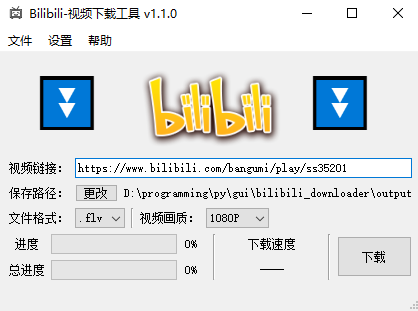
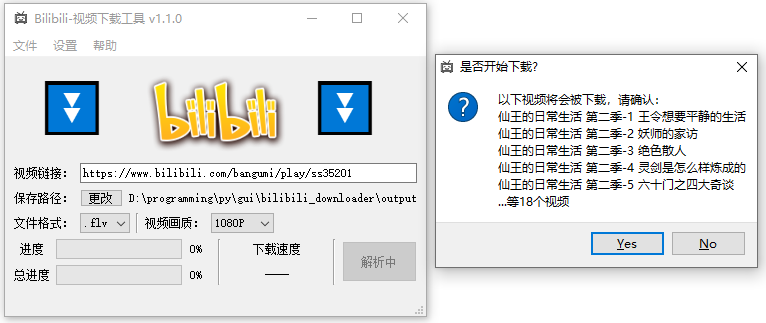
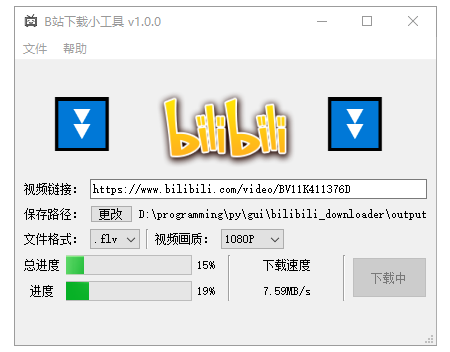

# Bilibili_downloader

LICENCE：GPL-3.0

## ⭐如果能下😁记得STAR⭐


| **项目地址**                                                 | **下载地址**                                                 |
| ------------------------------------------------------------ | ------------------------------------------------------------ |
| **[GitHub平台](https://github.com/laorange/bilibili_downloader/)** | **[GitHub发行版](https://github.com/laorange/bilibili_downloader/releases/latest)** |
| **[Gitee平台](https://gitee.com/laorange/bilibili_downloader/)** | **[Gitee发行版](https://gitee.com/laorange/bilibili_downloader/releases)** |

## 1.  特点

1. 使用了`PySide6`构建图形界面
2. 使用了`httpx`以协程方式下载
3. 借鉴了Java接口式、面向对象开发 (Java初学者的一次尝试😆)
4. 准 - 全类型标注（尽力了...）

## 2.功能

- [x] 能够下载bilibili单集的普通视频
- [x] 能够下载bilibili多集的普通视频
- [x] 能够下载bilibili番剧&电影

## 3.使用方法

### 3.1  普通视频

1. 在电脑浏览器上找到想要下载的b站视频，复制网页链接
2. 在“视频链接”后的文本输入框内粘贴该链接，另外：
   + 下载**单集视频**或者**多集视频**的全部：直接传入B站视频链接，例：[bilibili.com/video/BV11K411376D](https://www.bilibili.com/video/BV11K411376D)
   + 下载其中一集:传入那一集的链接 (网址中会包含 `?p=`)，例：[bilibili.com/video/BV11K411376D?p=8](https://www.bilibili.com/video/BV11K411376D?p=8)
3. 点击“下载”按钮

### 3.2  番剧/电影

1. 在“设置”-“设置cookie”中添加自己的SESSDATA (内含操作示意图)
2. 在电脑浏览器上找到想要下载的番剧，复制网页链接
3. 需要注意的是：
   + 如果想要下载番剧所属的全部视频，则网址中会包含 `ss`， 例：[bilibili.com/bangumi/play/ss39481](https://www.bilibili.com/bangumi/play/ss39481)
   + 如果想要下载番剧的某一集，则网址中会包含 `ep`， 例：[bilibili.com/bangumi/play/ep424836/](https://www.bilibili.com/bangumi/play/ep424836/)
4. 点击“下载”按钮

## 4.截图







## 5.一些想说的

+ **开发本程序仅用于学习交流，请勿用于任何商业用途！**
+ 普通视频的解析器是不需要用户自行更新cookies的加密版本；番剧/电影的下载器需要在“设置”-“设置cookie”中添加自己的SESSDATA。
+ ui中的“主进度”其实是正在下载的**文件的序号**占下载任务总数的百分比，因此由于协程下载的特性，会在各个文件反复横跳，因此“主进度”仅用于提升观赏效果。
+ 正因如此，本程序**同时下载多集视频**的效率**远高于**下载**单集视频**。

## 6.更新日志

### v1.2.1

- [x] 优化：下载地址会记录原视频链接
- [x] 优化：优化界面，(新增按钮：打开保存目录)

### v1.2.0

- [x] 变更：设置采用`Json`文件来储存设置信息，增强向下兼容性
- [x] 新增：可自定义异步下载数量上限
- [x] 新增：打开保存地址的按钮

### v1.1.4

- [x] 优化：视频下载后生成原视频地址快捷方式
- [x] 修复：视频末尾若有空格会导致本地路径不匹配
- [x] 优化：设置异步下载数量上限为5个（若无上限，在大量任务时会出错）

### v1.1.3

- [x] 修复：如果视频单集标题含有`/ `时会出错的bug
- [x] 优化：将pyside2替换升级为pyside6

### v1.1.2

- [x] 优化：文件名新增集数前缀，如(P1)
- [x] 优化：多个vip视频的情况会导致连环弹窗，更改为只弹窗一次

### v1.1.1

- [x] 新增：检查更新功能
- [x] 优化：部分交互

### v1.1.0

- [x] 新增：番剧/电影下载功能
- [x] 新增：可设置cookie
- [x] 修复：因为未转义导致的日志写入异常

### v1.0.1

- [x] 修复：日志只在重启程序后才刷新的bug

### v1.0.0

- [x] 新增：能够下载bilibili的普通视频
- [x] 修复：包含 `?p=`的链接会解析错误
- [x] 修复：在下载期间退出窗口，子线程仍在后台下载 或 主线程卡死无法退出
- [x] 修复：变更保存路径后，需要重启才能恢复，否则会报错

## 7.参考资料

+ 下载视频的接口参考了
  + [GitHub@Henry](https://github.com/Henryhaohao/) 的相关项目：[`Henryhaohao/Bilibili_video_download`](https://github.com/Henryhaohao/Bilibili_video_download)
  + [bilibili@凡云](https://space.bilibili.com/3491267) 的文章 [《2020年B站番剧相关API整合》](https://www.bilibili.com/read/cv5293665/)

## 8.对二次开发的构思

`VideoHandler`在初始化时，会调用`get_proper_video_parser`方法，如下方代码所示

```python
# video_handler.py
class VideoHandler:
    def __init__(self, url, quality: Union[str, int], video_format: str, save_path: Path):
		# ...
        self.video_parser: VideoParserInterface = self.get_proper_video_parser()

    def get_proper_video_parser(self) -> VideoParserInterface:
        if "bangumi" in self.url:
            return FanVideoParser(self.url, self.quality)  # 为了下载番剧/电影的解析器
        else:
            return NormalVideoParser(self.url, self.quality)  # 默认的解析器
```

可以在此方法中自定义返回的视频分析器(继承自`VideoParserInterface`)

```python
# video_parsers.py
class VideoParserInterface(abc.ABC):
    def __init__(self, url: str, quality: Union[str, int]):
        # ...
        self.downloader_list: List[VideoDownloader] = self.get_downloader_list()

    @abc.abstractmethod
    def get_downloader_list(self) -> List[VideoDownloader]:
        pass
```

`downloader_list`中的`VideoDownloader`，是下载器对象，下载方法用的异步函数

```python
# my_classes.py
class VideoDownloader:
    def __init__(self, title, page: PageInAPI):
        self.title = title
        self.page = page
        self.local_path = Path(__file__)  # 这里是随便设个值，反正后面要改

    async def download(self, save_path: Path, video_format: str = ".flv",
                       all_progress_value: Union[int, float] = 0, headers: dict = None):
        # ...
        with open(self.local_path / video_name, 'wb') as f:
            async with async_downloader.stream('GET', url) as response:
                async for chunk in response.aiter_bytes():
                    f.write(chunk)
```

`VideoDownloader.page` 的类型(`PageInAPI`)是用于记录某一集视频的详细信息 (命名由来：b站的API对某一集的视频的名为`Page`)，初始化参数`info_dict`是从api传来的json数据（转成字典后做实参传入）。特别说明，`VideoDownloader.title`类似于电视剧剧名，会作为文件夹的名字；此处的`PageInAPI.part`类似于电视剧每一集的集名，会作为视频的名称。

```python
# my_classes.py
class PageInAPI:
    """用于记录api中的单个Page的信息"""
    def __init__(self, info_dict: Dict[str, Union[int, str]]):
        self.part: str = info_dict.get("part", '视频名')
        self.url: List[str] = []
        self.size: List[int] = []
        # ...其他属性非必需，可以根据实际情况置空
        
    def set_url(self, url: str):
        self.url.append(url)

    def set_size(self, size: int = 1):
        self.size.append(size)
```

综上所述，若需要扩展其他下载器，或许可按以下步骤改写：

1. 自定义`视频分析器`(继承自`VideoParserInterface`)，并重写`get_downloader_list`方法，使其能返回`List[VideoDownloader]`
2. 更改`VideoHandler.get_proper_video_parser`中的逻辑，使其在指定条件下返回新的`视频分析器`。


